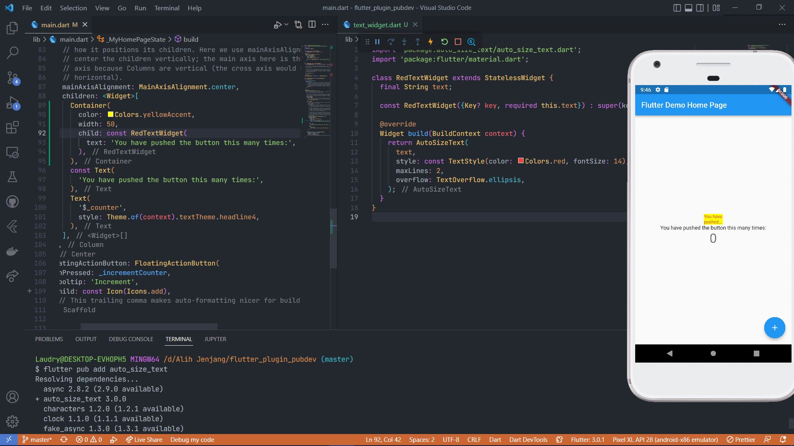

# flutter_plugin_pubdev

## Praktikum



### Jelaskan maksud dari langkah 2 pada praktikum tersebut!

perintah `flutter pub add auto_size_text` berfungsi untuk menambahkan plugin auto_size_text ke aplikasi

### Jelaskan maksud dari langkah 5 pada praktikum tersebut!

`final String text;`
`const RedTextWidget({Key? key, required this.text}) : super(key: key);`

menambahkan variable `text` tipe data string pada class `RedTextWidget` dan parameter required di constructor.

`required` berarti saat pemanggilan class tsb wajib menambahkan parameter text

### Pada langkah 6 terdapat dua widget yang ditambahkan, jelaskan fungsi dan perbedaannya!

```markdown
Container(
   color: Colors.yellowAccent,
   width: 50,
   child: const RedTextWidget(
             text: 'You have pushed the button this many times:',
          ),
),
Container(
    color: Colors.greenAccent,
    width: 100,
    child: const Text(
           'You have pushed the button this many times:',
          ),
),
```

pada widget Container pertama, lebar sebesar 50 berwarna kuning accent. memiliki child `RedTextWidget` dengan parameter `text`.

pada widget Container kedua, lebar sebesar 100, berwarna hijau accent, memiliki child `Text`

### Jelaskan maksud dari tiap parameter yang ada di dalam `plugin auto_size_text`

**maxLines**
_maksimal baris text_

**minFontSize**
_batasan ukuran minimum text_

**maxFontSize**
_batasan ukuran maksimal text_

**group**
_jika ingin memiliki ukuran text yang sama, beri semua text group yang sama_

**stepGranularity**
_menyesuaikan ukuran font dengan batasan_

**presetFontSizes**
_untuk mengijinkan ukuran font tertentu_

**overflowReplacement**
_untuk menampilkan message jika text terlalu over_

